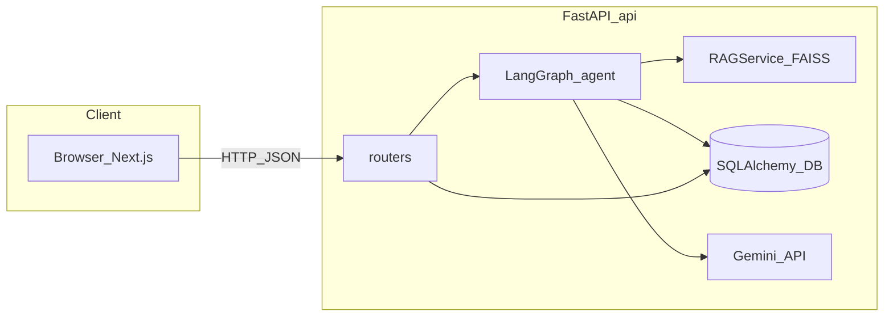
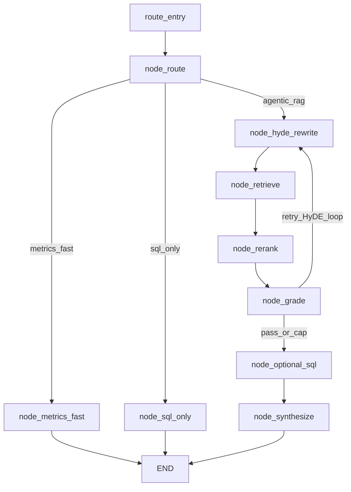

# DocSage

**DocSage** is an **agentic document-intelligence** system: ingest financial and business documents, persist **structured rows** (transactions) in a database, build a **semantic index** for question answering, and expose both through a **FastAPI** backend and a **Next.js** UI. The “brain” for generation is **Google Gemini**; retrieval uses **local FAISS** + **sentence-transformers**; multi-step reasoning is orchestrated with **LangGraph**.

---

## Table of contents

- [What DocSage does](#what-docsage-does)
- [Repository map](#repository-map)
- [Quick start (local)](#quick-start-local)
- [Configuration](#configuration)
- [Backend architecture](#backend-architecture)
- [Concept glossary](#concept-glossary) — IDP, OCR, RAG, FAISS, LangGraph, HyDE, SQL grounding, Gemini, …
- [LangGraph chat pipeline](#langgraph-chat-pipeline)
- [Document ingestion and data flow](#document-ingestion-and-data-flow)
- [HTTP API surface](#http-api-surface)
- [Frontend (web)](#frontend-web)
- [Dependencies, scripts, and containers](#dependencies-scripts-and-containers)
- [Deployment](#deployment)
- [Limitations and extension points](#limitations-and-extension-points)

---

## What DocSage does

1. **Upload** documents (PDF, images, etc.) via the API or UI.
2. **Parse** them through an **IDP-style** pipeline: text extraction (PDF and/or OCR), heuristic **classification**, and structured field extraction.
3. **Store** `Document` rows plus derived **`Transaction`** rows in **PostgreSQL** or **SQLite**.
4. **Index** in **FAISS** for **RAG**: per document, an **`extraction_summary`** chunk (from structured **`extracted_data`**) when present, plus chunked **`raw_text`**—each chunk carries **`chunk_type`**, **`chunk_index`**, and document metadata for **grounding** in API responses.
5. **Answer questions** via **`POST /api/v1/chat/insights`**: a **LangGraph** workflow can route between fast analytic paths, **SQL** over **`documents` + `transactions`** (with **JOIN** on `document_id`), and full **retrieve → rerank → grade → synthesize** agentic RAG with **HyDE**-style query rewriting. Optional **`history`** on the request enables **multi-turn** chat (last **20** turns used server-side); synthesis prompts insist on **filename** / **document_id** citations when evidence exists.



---

## Repository map

| Path | Role |
|------|------|
| [`api/`](api/) | Python package **`app`**: FastAPI entry [`api/app/main.py`](api/app/main.py), routers, services, agents, models, [`api/requirements.txt`](api/requirements.txt), [`api/Dockerfile`](api/Dockerfile). |
| [`api/app/routers/`](api/app/routers/) | HTTP route modules (analytics, documents, chat, anomalies, compare, receipts, export, insights report). |
| [`api/app/services/`](api/app/services/) | Business logic: RAG, LLM wrapper, IDP pipeline, SQL tools, **`extraction_summary`** helper ([`extraction_summary.py`](api/app/services/extraction_summary.py)), insights, anomalies, export, etc. |
| [`api/app/agents/`](api/app/agents/) | LangGraph graph compiler, nodes, state, [`langgraph_runner.py`](api/app/agents/langgraph_runner.py). |
| [`api/app/vectorstore/`](api/app/vectorstore/) | [`faiss_store.py`](api/app/vectorstore/faiss_store.py): FAISS + embeddings. |
| [`api/scripts/`](api/scripts/) | Operational scripts (seed, ingest, embeddings, diagnostics)—not started automatically. |
| [`web/`](web/) | **Next.js 14** App Router UI; entry layout [`web/src/app/layout.tsx`](web/src/app/layout.tsx), pages under [`web/src/app/`](web/src/app/). |
| [`web/src/lib/api.ts`](web/src/lib/api.ts) | Typed `fetch` helpers against `/api/v1`. |
| [`scripts/run-dev.sh`](scripts/run-dev.sh) | Local dev: optional Postgres, API + web. |
| [`docker-compose.postgres.yml`](docker-compose.postgres.yml) | Postgres-only Compose (used by dev script). |
| [`docker-compose.yml`](docker-compose.yml) | Postgres + API image. |
| [`docker-compose.prod.yml`](docker-compose.prod.yml) | Production-oriented Compose example. |
| [`railway.toml`](railway.toml) | Railway: Dockerfile build, uvicorn start, `/health`. |
| [`.env.example`](.env.example) | Template for **`api/.env`** (copy into `api/`). |
| `data/` (under **`api/`** at runtime) | Uploads and indexes: `raw_docs`, `embeddings`, `processed`—paths come from [`config.py`](api/app/config.py) (`RAW_DOCS_PATH`, `FAISS_*`, etc.) relative to the API working directory. Do not commit large **`api/data/`** trees; keep them local or on a volume. |

---

## Quick start (local)

**Prerequisites:** Node.js, Python 3.11+, optional Docker for Postgres, [Google AI Studio](https://aistudio.google.com/apikey) API key for LLM features.

From the **repository root**:

```bash
./scripts/run-dev.sh
```

- Uses [`docker-compose.postgres.yml`](docker-compose.postgres.yml) to start **Postgres** when Docker is available. If Docker is not running, the API and web still start; use `USE_SQLITE=true` in `api/.env` for a file DB, or start Docker and rerun.
- Copies [`.env.example`](.env.example) → `api/.env` once if missing; ensures `web/.env.local` has `NEXT_PUBLIC_API_URL`.
- Recreates `api/.venv` if broken; installs Python and npm deps; runs **uvicorn** and **`npm run dev`**.

**Ports:** `API_PORT` (default `8000`), `WEB_PORT` (default `3000`). UI: [http://localhost:3000](http://localhost:3000); OpenAPI: [http://localhost:8000/docs](http://localhost:8000/docs).

**Busy Postgres port:** `POSTGRES_PORT=5433 ./scripts/run-dev.sh` and set `POSTGRES_PORT=5433` in `api/.env`.

**Skip Docker:** `./scripts/run-dev.sh --no-docker`

### Database initialization

On API startup, [`api/app/main.py`](api/app/main.py) runs a **lifespan** hook that calls [`init_db()`](api/app/db.py): SQLAlchemy **`create_all`** for models in [`api/app/models.py`](api/app/models.py). This creates missing tables (e.g. `documents`, `transactions`) but does **not** run Alembic-style migrations for schema changes.

---

## Configuration

### API ([`api/app/config.py`](api/app/config.py) + `api/.env`)

Settings load from environment and optional `api/.env`. Unknown keys are **ignored** (`extra="ignore"`) so stale variables do not crash startup.

| Variable | Purpose |
|----------|---------|
| `POSTGRES_USER`, `POSTGRES_PASSWORD`, `POSTGRES_DB`, `POSTGRES_HOST`, `POSTGRES_PORT` | PostgreSQL connection when `USE_SQLITE` is false. |
| `USE_SQLITE` | If `true`, `DATABASE_URL` is SQLite (`sqlite:///./docsage.db`). |
| `API_HOST`, `API_PORT` | Uvicorn bind (used when running `app.main` as `__main__`). |
| `GOOGLE_API_KEY` | Gemini API key; alias **`GEMINI_API_KEY`**. |
| `GOOGLE_AI_MODEL` | Primary **`generateContent`** model id. |
| `GOOGLE_AI_MODEL_FALLBACKS` | Comma-separated fallback model ids (overload / transient errors / unknown primary). |
| `FAISS_INDEX_PATH`, `FAISS_DOCUMENTS_PATH` | Paths to FAISS index file and pickle sidecar for chunk metadata. |
| `EMBEDDING_MODEL` | `sentence-transformers` model name (default `all-MiniLM-L6-v2`, 384-d vectors). |
| `RAW_DOCS_PATH`, `PROCESSED_PATH` | Upload and processed file roots. |
| `CORS_ORIGINS` | Comma-separated browser origins, or `*` (dev only; avoid in production). |
| `MAX_UPLOAD_MB` | Upload size cap for document uploads. |
| `DEBUG`, `LOG_LEVEL` | App logging / debug flags. |

### Web

| Variable | Purpose |
|----------|---------|
| `NEXT_PUBLIC_API_URL` | Origin of the FastAPI server (no trailing slash), e.g. `http://127.0.0.1:8000`. Used by [`web/src/lib/api.ts`](web/src/lib/api.ts). |
| `NEXT_PUBLIC_SITE_URL` | Optional canonical site URL for metadata. If unset on Vercel, **`VERCEL_URL`** is used in [`web/src/app/layout.tsx`](web/src/app/layout.tsx) for `metadataBase`. |

**Docker Compose:** pass `GOOGLE_API_KEY`, `GOOGLE_AI_MODEL`, `GOOGLE_AI_MODEL_FALLBACKS` into the `api` service (see [`docker-compose.yml`](docker-compose.yml), [`docker-compose.prod.yml`](docker-compose.prod.yml)).

---

## Backend architecture

### FastAPI application

[`api/app/main.py`](api/app/main.py) constructs the app with:

- **CORS** from `settings.cors_origins_list`.
- **`APIRouter`** subtree mounted at **`/api/v1`** including analytics, anomalies, documents, compare, receipts, export, insights report, chat.
- **Legacy** `POST /chat/insights` delegating to the same handler as v1 chat.

### Persistence

- **SQLAlchemy 2.x** engine + **`SessionLocal`** in [`api/app/db.py`](api/app/db.py).
- **Models** in [`api/app/models.py`](api/app/models.py):
  - **`Document`**: filename, path, type, raw text, JSON `extracted_data`, timestamps.
  - **`Transaction`**: `document_id`, `date`, `amount`, `vendor`, `category`, `description`, JSON `metadata` (ORM attribute `meta_data` to avoid reserved name issues), confidence / correction flags.
  - **`DocumentCorrection`**: audit of user corrections.

Routers use **`Depends(get_db)`** for request-scoped sessions.

### Validation

[`api/app/schemas.py`](api/app/schemas.py) defines **Pydantic** models for HTTP I/O. Notable:

- **`QueryRequest`**: **`query`**, **`use_rag`**, **`use_sql`**, optional **`history`** (`List[ChatMessage]` with **`role`** and **`content`**). The chat router keeps the last **20** turns with non-empty content. **`use_rag`** / **`use_sql`** bias LangGraph routing (e.g. SQL-only path when RAG is off and keywords suggest aggregation).

---

## Concept glossary

Each item: **what the concept is**, then **how DocSage applies it** (files).

### Intelligent Document Processing (IDP)

**IDP** is the class of systems that turn messy documents (PDFs, scans) into **structured, machine-usable data**—classification, key-value extraction, validation—not just raw text.

**DocSage:** [`api/app/services/idp_pipeline.py`](api/app/services/idp_pipeline.py) implements extraction and heuristic classification; the upload path in [`api/app/routers/documents.py`](api/app/routers/documents.py) calls **`parse_document`** then persists rows. This is “IDP-inspired”: rules + LLM/heuristics rather than a full enterprise IDP product.

### OCR (Optical Character Recognition)

**OCR** recovers **text from pixels** (photos, scanned pages).

**DocSage:** **`pytesseract`** with **`Pillow`**-compatible inputs in **`extract_text_with_ocr`** ([`idp_pipeline.py`](api/app/services/idp_pipeline.py)). The **Docker image** installs **`tesseract-ocr`** ([`api/Dockerfile`](api/Dockerfile)) so containers can OCR without extra host setup.

### PDF text extraction

**Digital PDFs** often expose a text layer; extraction without OCR is faster and more accurate.

**DocSage:** **`pdfplumber`** in **`extract_text_from_pdf`** walks pages and concatenates **`extract_text()`** output ([`idp_pipeline.py`](api/app/services/idp_pipeline.py)). Image-only PDFs may still need rasterization + OCR (pipeline-dependent).

### Heuristic classification and regex extraction

**Heuristics** use keywords and patterns to guess **document type** and pull **amounts**, **dates**, and **vendors** without a dedicated ML model per field.

**DocSage:** **`classify_document`**, **`extract_amounts`**, and related helpers in [`idp_pipeline.py`](api/app/services/idp_pipeline.py); extracted JSON is stored on **`Document.extracted_data`** and **`Transaction`** rows are synthesized via **`extract_transactions_from_document`** ([`api/scripts/ingest_docs.py`](api/scripts/ingest_docs.py)) used from the documents router.

### Embeddings

An **embedding** is a dense vector representing text (or other modalities) in a space where **semantic similarity** ≈ **vector proximity**.

**DocSage:** **`SentenceTransformer`** in [`api/app/vectorstore/faiss_store.py`](api/app/vectorstore/faiss_store.py) encodes strings; default model **`all-MiniLM-L6-v2`** produces **384-dimensional** vectors (`EMBEDDING_MODEL` in config). [`api/scripts/build_embeddings.py`](api/scripts/build_embeddings.py) walks all **`Document`** rows and, for each, emits (**1**) a single **`extraction_summary`** string via **`extraction_to_index_text`** ([`extraction_summary.py`](api/app/services/extraction_summary.py)) when **`extracted_data`** is present, and (**2**) sliding-window chunks over **`raw_text`** when present. Metadata on each vector row includes **`chunk_type`** (`extraction_summary` vs `raw_text`), **`chunk_index`**, **`total_chunks`** (for raw splits), and document id/filename—used downstream for **rerank `sources`** and UI citations.

### Vector store and approximate search (FAISS)

A **vector store** indexes vectors for **nearest-neighbor** search (which chunks are closest to the query embedding).

**DocSage:** **FAISS** **`IndexFlatL2`**—exact L2 search over all vectors (simple, no training). Index and parallel **pickle** list of metadata are saved to **`FAISS_INDEX_PATH`** / **`FAISS_DOCUMENTS_PATH`** (relative to API cwd, typically **`api/data/embeddings/`** in local dev). [`RAGService`](api/app/services/rag.py) loads the index **if files exist** and exposes **`search(query, k)`**.

### RAG (Retrieval-Augmented Generation)

**RAG** grounds LLM answers in **retrieved passages** from a corpus instead of parametric memory alone, reducing hallucination on factual questions about *your* documents.

**DocSage:** [`RAGService`](api/app/services/rag.py) wraps the FAISS store; LangGraph nodes call **`search`** with a rewritten query after **HyDE** and optional **reranking** ([`api/app/agents/langgraph/nodes.py`](api/app/agents/langgraph/nodes.py)). **`node_rerank`** / **`node_synthesize`** attach **`sources`**: **`document_id`**, **`filename`**, **`chunk_index`**, **`chunk_type`**, **`score`** for citation-style UX; final synthesis instructs the model to cite filename and document id when evidence exists and to avoid inventing facts when context and SQL are empty.

### LangGraph and agentic control flow

**LangGraph** models an agent as a **state machine**: **nodes** (functions) update **state**; **edges** (conditional or fixed) choose the next step. “Agentic” here means **multiple LLM and tool steps** with branching, not a single prompt.

**DocSage:** [`build_agent_graph`](api/app/agents/langgraph/graph.py) compiles a **`StateGraph`** over **`AgentState`** ([`api/app/agents/langgraph/state.py`](api/app/agents/langgraph/state.py)) including optional **`history`** for multi-turn prompts. [`run_agent_pipeline`](api/app/agents/langgraph_runner.py) invokes the compiled graph with **`graph.invoke`**, then shapes the response for the REST API.

**LangChain packages** in [`api/requirements.txt`](api/requirements.txt) (`langchain-core`, `langchain-community`) support the broader ecosystem; application code under `app/` imports **LangGraph** directly rather than high-level LangChain chains.

### HyDE (Hypothetical Document Embeddings)

**HyDE** asks the LLM to **draft a fake answer or passage** that would answer the question; that text is **embedded and used to retrieve** real chunks. It often improves recall when the raw user question is short or mismatched to chunk wording.

**DocSage:** **`node_hyde_rewrite`** in [`nodes.py`](api/app/agents/langgraph/nodes.py) calls **`call_llm`** to produce a hypothetical block; retrieval uses the rewritten text (see also **`refinement_hint`** on failed grades). **HyDE**, grading, SQL generation, and synthesis prompts also receive a compact **conversation** block from **`history`** when the client sends prior turns.

### Retrieval depth, cross-encoder reranking, and grading loop

**Two-stage retrieval** can mean: (1) **cheap bi-encoder** over many candidates, then (2) **cross-encoder** scoring query–passage pairs for a top subset. A **grader** decides if context is good enough or triggers **another** retrieval loop.

**DocSage:** constants **`RETRIEVE_K`**, **`RERANK_POOL`**, **`RERANK_KEEP`**, **`MAX_RETRIEVAL_LOOPS`** in [`nodes.py`](api/app/agents/langgraph/nodes.py). **`cross-encoder/ms-marco-MiniLM-L-6-v2`** scores pairs. **`node_grade`** sets **`grade_pass`**; conditional edges in [`graph.py`](api/app/agents/langgraph/graph.py) send failures back to **`hyde`** until the cap, then proceed to **`optional_sql`** → **`synthesize`**.

### SQL grounding (LLM-generated SELECT)

**Grounding** here means the LLM sees the **real table schema** and **sample rows** before emitting **read-only SQL** executed against your DB.

**DocSage:** [**`SQLTools`**](api/app/services/sql_tools.py) introspects **`transactions`** for low-level helpers and exposes **`get_multitable_sql_llm_context()`**—combined **`documents`** + **`transactions`** schemas, truncated **`raw_text`** previews, and shrunk **`extracted_data`** in document samples (SQLite vs Postgres aware). **`_generate_sql`** in [`nodes.py`](api/app/agents/langgraph/nodes.py) includes that context, the user question, and a short **conversation** block from **`history`**, and explains that **`transactions.document_id`** references **`documents.id`** (**`JOIN`** allowed). **`node_sql_only`** and **`node_optional_sql`** merge SQL results into answers; optional SQL is keyword-gated (including document/invoice-style terms).

### Fast analytic path (metrics shortcut)

Some questions match **precomputed aggregates** faster than full RAG.

**DocSage:** **`node_route`** checks **keyword hints** for vendor/category breakdowns and routes to **`node_metrics_fast`**, which calls **`InsightsService`** ([`api/app/services/insights.py`](api/app/services/insights.py)) and returns without vector search ([`nodes.py`](api/app/agents/langgraph/nodes.py)).

### Anomaly detection

**Anomaly detection** flags unusual rows (duplicates, outliers, date oddities).

**DocSage:** [`api/app/services/anomaly_detection.py`](api/app/services/anomaly_detection.py); exposed via [`api/app/routers/anomalies.py`](api/app/routers/anomalies.py).

### Google Gemini (Generative Language API)

**Gemini** is accessed through **REST** `generateContent` (**v1beta**), not a proprietary SDK requirement in this repo.

**DocSage:** [`api/app/services/llm_service.py`](api/app/services/llm_service.py) builds the request with optional **`systemInstruction`**, walks a **model chain** (primary + **`GOOGLE_AI_MODEL_FALLBACKS`**), retries **429 / 5xx** with backoff and optional **`Retry-After`**, skips to the next model on **400 / 404** (e.g. deprecated model id), and returns assistant text or structured error strings.

---

## LangGraph chat pipeline

### Graph topology (mermaid)

Mirrors [`api/app/agents/langgraph/graph.py`](api/app/agents/langgraph/graph.py).



> The **`grade → hyde`** edge is conditional: only when **`grade_pass`** is false and **`retrieval_iteration`** is below **`MAX_RETRIEVAL_LOOPS`** ([`_grade_next`](api/app/agents/langgraph/graph.py)).

### HTTP entry and response shape

[`api/app/routers/chat.py`](api/app/routers/chat.py):

- Lazily constructs a singleton **`RAGService`** (loads FAISS if index files exist).
- **`run_chat`** maps **`request.history`** to the graph (last **20** non-empty turns).
- **`run_chat`** calls **`run_agent_pipeline(query, rag, use_rag=..., use_sql=..., history=...)`**.
- Returns **`QueryResponse`**: **`answer`**, **`sources`** (list of dicts with **`document_id`**, **`filename`**, **`chunk_index`**, **`chunk_type`**, **`score`** when RAG ran), **`sql_query`**, **`steps`**, **`tool_calls`** (derived from steps for UI convenience).

**When RAG is “skipped” in spirit:** `use_rag=False` with SQL-biased routing yields **`sql_only`**. **`use_rag=False`** also clears sources in the runner output. **`use_sql=False`** disables the optional SQL augmentation node path in the graph state.

### Other LLM call sites (outside the graph)

Several features call **`call_llm`** directly without LangGraph: e.g. **insights report** generation ([`api/app/services/insights_generator.py`](api/app/services/insights_generator.py)), **categorization** ([`api/app/services/categorization.py`](api/app/services/categorization.py)), **HyDE / synthesize / SQL prompt** nodes. The graph is the **orchestrator** for interactive chat; batch/report flows may be linear.

---

## Document ingestion and data flow

1. **POST** `/api/v1/documents` with multipart file ([`documents.py`](api/app/routers/documents.py)).
2. File bytes saved under **`RAW_DOCS_PATH`**.
3. **`parse_document(path)`** runs the IDP pipeline ([`idp_pipeline.py`](api/app/services/idp_pipeline.py)).
4. **`Document`** inserted; **`extract_transactions_from_document`** yields dicts → **`Transaction`** rows committed.
5. **FAISS** is **not** automatically rebuilt on every upload. After new imports, **extraction** changes, or IDP tweaks, refresh vectors so **`extraction_summary`** and **`raw_text`** chunks stay in sync—for example:

   ```bash
   cd api && ./.venv/bin/python scripts/build_embeddings.py
   ```

   You can also use **`RAGService.build_index`** / **`add_documents`** ([`rag.py`](api/app/services/rag.py)) in custom ops; **`add_documents`** currently rebuilds the full index for simplicity.

---

## HTTP API surface

All v1 routes are prefixed with **`/api/v1`** unless noted.

| Tag | Method | Path | Purpose |
|-----|--------|------|---------|
| **analytics** | GET | `/analytics/summary` | Dashboard KPIs: counts, spend, averages. |
| | GET | `/analytics/time-series` | Time-bucketed series for charts. |
| | GET | `/analytics/vendor-stats` | Top vendors by spend. |
| | GET | `/analytics/category-breakdown` | Spend by category. |
| | GET | `/analytics/spending-forecast` | Simple forward-looking projection. |
| | GET | `/analytics/monthly-spend` | Spend for a given year/month. |
| **anomalies** | GET | `/anomalies` | Rule-based anomaly list. |
| **chat** | POST | `/chat/insights` | Agentic RAG + SQL pipeline. Body: **`query`** (required), **`use_rag`**, **`use_sql`**, optional **`history`** (array of `{ role, content }`, server uses last 20 non-empty turns). |
| **compare** | GET | `/documents/{document_id}/similar` | Similar documents (e.g. shared vendor / join logic in service). |
| | POST | `/documents/compare` | Pairwise diff / compare (`CompareBody`). |
| **documents** | GET | `/documents` | List documents (filters, pagination). |
| | POST | `/documents` | Upload + parse + persist transactions. |
| | GET | `/documents/{id}` | Metadata. |
| | GET | `/documents/{id}/detail` | Rich detail payload. |
| | GET | `/documents/{id}/confidence` | Extraction confidence signals. |
| | GET | `/documents/{id}/preview` | Preview / annotated stream where implemented. |
| | PATCH | `/documents/{id}` | Update extracted JSON (`DocumentUpdateBody`). |
| **exports** | GET | `/exports/excel` | Download Excel export blob. |
| | GET | `/exports/summary` | Text/markdown summary for export UX. |
| **insights-report** | POST | `/insights/generate-report` | LLM-generated narrative report. |
| **receipt-matching** | GET | `/receipt-matching/unmatched` | Queue of unmatched receipts. |
| | POST | `/receipt-matching/{receipt_doc_id}/match` | Link receipt to candidate transaction. |

**Legacy (no `/api/v1` prefix):** `POST /chat/insights` — same body/response as v1 chat.

Interactive docs: **`/docs`** (Swagger UI).

---

## Frontend (web)

- **Framework:** **Next.js 14** **App Router** — file-based routes under [`web/src/app/`](web/src/app/).
- **Data fetching:** [`@tanstack/react-query`](web/package.json) on dashboard and other data screens; **`fetch`** wrappers in [`web/src/lib/api.ts`](web/src/lib/api.ts) target **`${NEXT_PUBLIC_API_URL}/api/v1`**.
- **Chat:** [`chat/page.tsx`](web/src/app/chat/page.tsx) sends the **last 20** user/assistant turns as **`history`** with each **`POST /chat/insights`** request so follow-up questions keep context server-side.
- **Theming:** **`next-themes`** with Tailwind **`darkMode: "class"`**; landing vs app shell split in [`web/src/components/ShellLayout.tsx`](web/src/components/ShellLayout.tsx) (`/` uses marketing layout; other routes use [`AppShell`](web/src/components/AppShell.tsx) sidebar).
- **Motion:** **Framer Motion** primitives ([`web/src/components/motion/`](web/src/components/motion/)).
- **Icons / branding:** logos in [`web/public/`](web/public/) (`logo.png`, `logo-dark.png`); favicons **`favicon.ico`**, **`icon.png`**, **`apple-icon.png`** with **`metadata.icons`** in [`layout.tsx`](web/src/app/layout.tsx).

**Pages (examples):** `dashboard`, `chat`, `documents`, `insights`, `anomalies`, `compare`, `export`, `receipt-matching`; marketing home composes [`LandingStory`](web/src/components/LandingStory.tsx).

---

## Dependencies, scripts, and containers

### Python ([`api/requirements.txt`](api/requirements.txt)) — grouped by role

| Group | Examples |
|-------|-----------|
| **HTTP** | `fastapi`, `uvicorn`, `python-multipart`, `pydantic`, `pydantic-settings` |
| **DB** | `sqlalchemy`, `psycopg2-binary` |
| **Agents** | `langgraph`, `langchain-core`, `langchain-community` |
| **Vectors / ML** | `faiss-cpu`, `sentence-transformers`, `numpy`, `pandas` |
| **Documents** | `pdfplumber`, `pytesseract`, `Pillow`, `opencv-python`, `openpyxl` |
| **LLM HTTP** | `requests` |

### Operational scripts ([`api/scripts/`](api/scripts/))

Not invoked by default: **`seed_db.py`**, **`ingest_docs.py`**, **`build_embeddings.py`**, **`migrate_database.py`**, **`add_documents_from_folder.py`**, **`diagnose_and_fix_transactions.py`**, **`download_huggingface_dataset.py`**, **`preload_kaggle_invoices.py`**, etc. Use them manually for migrations, backfills, demo data, and embedding rebuilds.

### Docker

[`api/Dockerfile`](api/Dockerfile) **`COPY`s from repo root**: `docker build -f api/Dockerfile .` installs **Tesseract** system packages, Python deps, copies **`api/app`** and **`api/scripts`**, creates **`data/`** subtrees, runs **uvicorn** on port **8000**.

Compose files wire Postgres + env; see repository root YAMLs.

### Railway

[`railway.toml`](railway.toml): **Dockerfile** builder, **`uvicorn app.main:app --host 0.0.0.0 --port $PORT`**, health check **`/health`**, restart policy.

---

## Deployment

- **Frontend:** deploy subdirectory **`web/`** (e.g. Vercel). Set **`NEXT_PUBLIC_API_URL`** to your API’s public origin. Set **`NEXT_PUBLIC_SITE_URL`** or rely on **`VERCEL_URL`** for metadata (see layout).
- **Backend:** container host (Fly, Railway, Cloud Run, etc.) using **`api/Dockerfile`** with **root build context**. Inject **`GOOGLE_API_KEY`**, DB URL, **`CORS_ORIGINS`** matching the **exact** browser origin(s) in production.
- **Persistence:** mount a volume (or object storage strategy) for **`api/data/raw_docs`**, **`api/data/embeddings`**, and the SQLite file if used—ephemeral disks lose indexes and uploads on restart.

---

## Limitations and extension points

| Area | Limitation | Possible extension |
|------|-------------|-------------------|
| **FAISS** | **`IndexFlatL2`** is linear; slow at very large N | IVF / HNSW, or managed vector DB (Pinecone, pgvector, …). |
| **Index updates** | **`add_documents`** rebuilds whole index | Incremental add, background jobs, versioning. |
| **Schema** | **`create_all`** only; no Alembic in tree | Migrations for production schema evolution. |
| **Chat** | **`history`** trimmed to **20** turns with content ([`chat.py`](api/app/routers/chat.py)) | Configurable cap, thread storage, or rolling summary. |
| **OCR** | Host must have Tesseract unless using Docker image | Cloud OCR APIs, better layout models. |
| **Compare routes** | Mounted at `/documents/...` alongside document CRUD | Ensure route ordering in OpenAPI matches FastAPI resolution for edge IDs. |
| **Secrets** | **Never commit** real `GOOGLE_API_KEY`; rotate if leaked | Secret manager, `.env` gitignored (already). |

This README is the **authoritative high-level map** of the codebase; for line-level behavior, follow the links into `api/app/` and `web/src/`.
